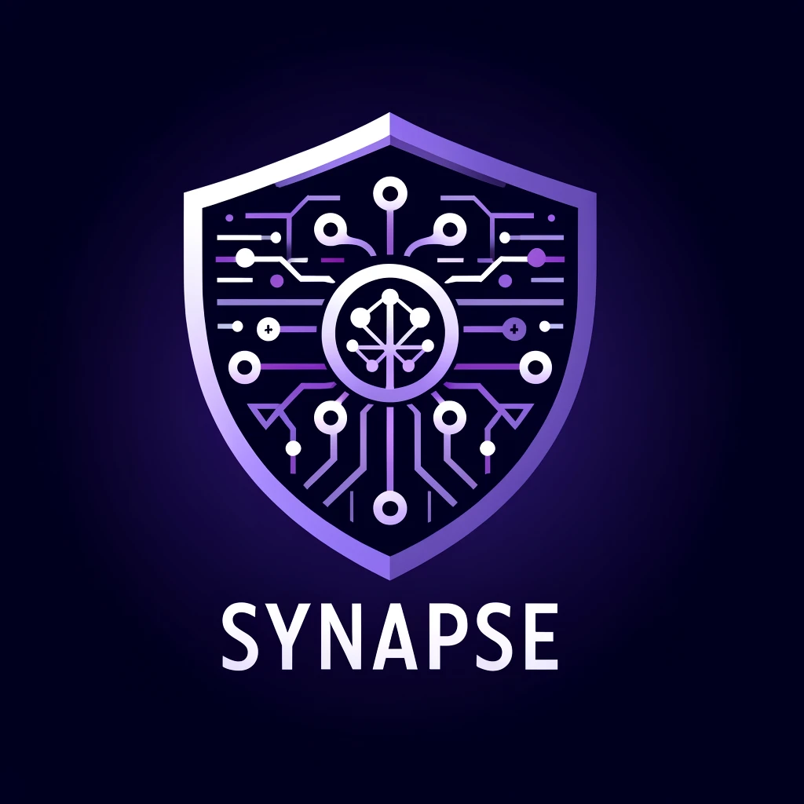

<!-- Improved compatibility of back to top link: See: https://github.com/othneildrew/Best-README-Template/pull/73 -->
<a name="readme-top"></a>
<!--
*** Thanks for checking out the Best-README-Template. If you have a suggestion
*** that would make this better, please fork the repo and create a pull request
*** or simply open an issue with the tag "enhancement".
*** Don't forget to give the project a star!
*** Thanks again! Now go create something AMAZING! :D
-->


<!-- PROJECT SHIELDS -->
<!--
*** I'm using markdown "reference style" links for readability.
*** Reference links are enclosed in brackets [ ] instead of parentheses ( ).
*** See the bottom of this document for the declaration of the reference variables
*** for contributors-url, forks-url, etc. This is an optional, concise syntax you may use.
*** https://www.markdownguide.org/basic-syntax/#reference-style-links
-->
[![Contributors][contributors-shield]][contributors-url]
[![Forks][forks-shield]][forks-url]
[![Stargazers][stars-shield]][stars-url]
[![Issues][issues-shield]][issues-url]
[![MIT License][license-shield]][license-url]
[![LinkedIn][linkedin-shield]][linkedin-url]


<!-- PROJECT LOGO -->
<br />
<div align="center">
  <a href="https://github.com/eneagizzarelli/synapse">
    
  </a>

<h3 align="center">SYNAPSE</h3>

  <p align="center">
    SYNthetic AI Pot for Security Enhancement
    <br />
    <a href="https://github.com/eneagizzarelli/synapse"><strong>Explore the docs »</strong></a>
    <br />
    <br />
    <a href="https://github.com/eneagizzarelli/synapse/issues/new?labels=bug&template=bug_report.md">Report Bug</a>
    ·
    <a href="https://github.com/eneagizzarelli/synapse/issues/new?labels=enhancement&template=feature_request.md">Request Feature</a>
  </p>
</div>


<!-- TABLE OF CONTENTS -->
<details>
  <summary>Table of Contents</summary>
  <ol>
    <li><a href="#about-the-project">About The Project</a></li>
    <li><a href="#installation">Installation</a></li>
    <li><a href="#usage">Usage</a></li>
    <li><a href="#license">License</a></li>
    <li><a href="#contact">Contact</a></li>
    <li><a href="#acknowledgments">Acknowledgments</a></li>
  </ol>
</details>


<!-- ABOUT THE PROJECT -->
## About The Project

**SYNAPSE** is a low-interaction server dynamic **honeypot** acting as a Linux OS terminal, written in Python. Instead of relying on a real terminal, SYNAPSE works with **generative AI** (currently _GPT 4o_ model) to answer with plausible terminal outputs, as if the user was connecting to a real Linux OS. It implements the simulation of two services:
 - SSH Server
 - MySQL Server
 
Leverages **SYNAPSE-to-MITRE** submodule to automatically map logs into attack techniques of the [MITRE ATT&CK](https://attack.mitre.org) database.

<p align="right">(<a href="#readme-top">back to top</a>)</p>

## Installation

1. Clone this repository
   ```sh
   git clone https://github.com/eneagizzarelli/SYNAPSE.git
   ```
2. Enter the project folder and install requirements
   ```sh
   pip install -r requirements.txt
   ```
4. Create a .env file and add your OpenAI key
   ```js
   OPENAI_API_KEY='YOUR KEY';
   ```

<p align="right">(<a href="#readme-top">back to top</a>)</p>


<!-- USAGE EXAMPLES -->
## Usage 

Modify your `/etc/ssh/sshd_config` file in order to run `startSYNAPSE.sh` script whenever a user connects to your machine using SSH. Example:
```sh
Match User enea
	ForceCommand /home/enea/SYNAPSE/scripts/startSYNAPSE.sh
	X11Forwarding no
	AllowTcpForwarding no
	AllowAgentForwarding no
	PermitTunnel no
	PermitOpen none
```
In our configuration, SYNAPSE project folder has been cloned in a machine under the specific path _/home/enea/SYNAPSE_. Every script/source file in this project refers to other scripts/source files using the above absolute path as a base path. If you use a different configuration, remember to change the path everywhere.

Also, if you are hosting the code on a VM like AWS EC2 and you want to allow password authentication, remember to change your `/etc/ssh/sshd_config.d/50-cloud-init.conf` file setting `PasswordAuthentication yes`.

<p align="right">(<a href="#readme-top">back to top</a>)</p>


<!-- LICENSE -->
## License

Distributed under the MIT License. See `LICENSE` for more information.

<p align="right">(<a href="#readme-top">back to top</a>)</p>


<!-- CONTACT -->
## Contact

Enea Gizzarelli - eneagizzarelli2000@gmail.com

Project Link: [https://github.com/eneagizzarelli/SYNAPSE](https://github.com/eneagizzarelli/synapse)

<p align="right">(<a href="#readme-top">back to top</a>)</p>


<!-- ACKNOWLEDGMENTS -->
## Acknowledgments

* [shelLM](https://github.com/stratosphereips/SheLLM)
* [GeoLite.mmdb](https://github.com/P3TERX/GeoLite.mmdb)
* [cti-to-mitre-with-nlp](https://github.com/dessertlab/cti-to-mitre-with-nlp)

<p align="right">(<a href="#readme-top">back to top</a>)</p>


<!-- MARKDOWN LINKS & IMAGES -->
<!-- https://www.markdownguide.org/basic-syntax/#reference-style-links -->
[contributors-shield]: https://img.shields.io/github/contributors/eneagizzarelli/synapse.svg?style=for-the-badge
[contributors-url]: https://github.com/eneagizzarelli/synapse/graphs/contributors
[forks-shield]: https://img.shields.io/github/forks/eneagizzarelli/synapse.svg?style=for-the-badge
[forks-url]: https://github.com/eneagizzarelli/synapse/network/members
[stars-shield]: https://img.shields.io/github/stars/eneagizzarelli/synapse.svg?style=for-the-badge
[stars-url]: https://github.com/eneagizzarelli/synapse/stargazers
[issues-shield]: https://img.shields.io/github/issues/eneagizzarelli/synapse.svg?style=for-the-badge
[issues-url]: https://github.com/eneagizzarelli/synapse/issues
[license-shield]: https://img.shields.io/github/license/eneagizzarelli/synapse.svg?style=for-the-badge
[license-url]: https://github.com/eneagizzarelli/synapse/blob/main/LICENSE
[linkedin-shield]: https://img.shields.io/badge/-LinkedIn-black.svg?style=for-the-badge&logo=linkedin&colorB=555
[linkedin-url]: https://linkedin.com/in/eneagizzarelli
